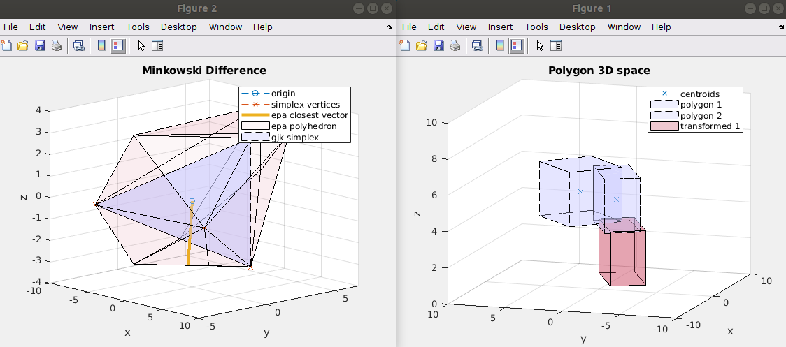

# GJK_EPA_MATLAB
GJK and EPA polygon collision used in physics game engines

`Each of the matlab code runs on its own`

**Sample Image**

## Notes
0. EPA implementation : https://github.com/kevinmoran/GJK/blob/master/GJK.h
1. GJK implementation : https://github.com/mws262/MATLAB-GJK-Collision-Detection