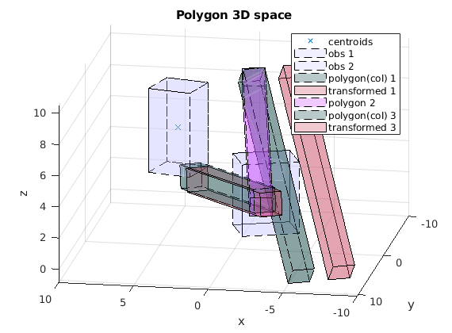
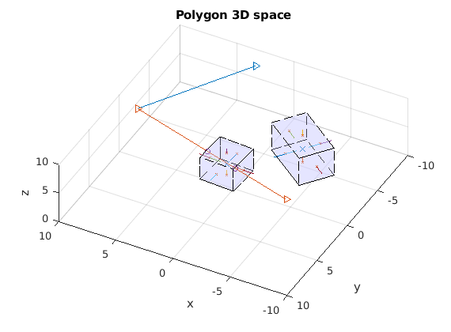

# GJK_EPA_MATLAB
GJK and EPA polygon collision used in physics game engines, to find a collision free path. How to use? `Each of the matlab scripts` runs on its own and serves a particular function as stated in the `script title`.

1. **Sample output** of `b4_epa_function.m` which provides the results of EPA in the polygon 3D space and also the minkowski difference

2. **Sample output** of `c2_epa_safety_obs.m` which provides the output of collision between corridors and obstacles

3. **Sample output** of `d1_ray_plane_intersection.m` which provides the results for line polygon intersection, detection of point in quad-face

## Notes
0. EPA implementation : https://github.com/kevinmoran/GJK/blob/master/GJK.h
1. GJK implementation : https://github.com/mws262/MATLAB-GJK-Collision-Detection